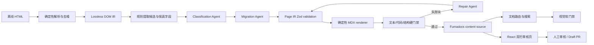

# cppreference → Markdown/MDX 文档平台迁移研究

研究日期：2026-08-12

## 结论

这个项目可行。结合 2026-08-12 对两个平台当前源码与官方文档的复核，**若 Zensical 不是硬约束，应改用 Fumadocs 作为站点与渲染底座**：

- **Fumadocs 适合本项目**：原生 React/MDX、RSC、可注入自定义语义组件、内容 schema、页面树、搜索、i18n、静态生成和完全自定义审核路由均已存在。MIT 核心开源；当前核验版本为 `fumadocs-core`/`fumadocs-ui` 16.14.3、`fumadocs-mdx` 15.2.3、Next.js 16.3.0。
- **Zensical 当前仍不是 MDX 运行时**：它使用 Python Markdown；Markdown/HTML AST、可复用组件和 island 交互组件仍在路线图中。用它实现版本选择、复杂声明/表格和 React 审核台，会形成一套过渡性的 Python Markdown 扩展、模板与 JavaScript 组件体系。
- **Fumadocs 不等于迁移引擎**：HTML 清洗、Page IR、Agent 语义分类、确定性渲染、门禁与审核工作流仍需自建。迁移端也采用 TypeScript，使 Zod schema、MDX 组件属性和审核 API 共用类型；应保留平台无关的 Page IR，不让 6,640 页内容真源绑定到任何框架语法。
- **6,640 页不能直接套默认 bundler 全量预编译**：Fumadocs 官方只明确称典型 bundler 足以处理约 500+ MDX，并警告大量 MDX 冷构建会高内存；官方示例约 2,500 文件 × 25 ms = 62.5 s。应在 100–500 页 PoC 中比较 `async`、`dynamic`、`@fumadocs/local-md` 和自定义 source，再冻结生产路径。

迁移本质是**Agent 驱动的耐久批处理**，但不是让多个角色自由聊天。确定性代码负责解析、去噪、保真字段提取和验证；Agent 是必经的语义分类与结构映射层，因为 cppreference 的 class 组合和上下文语义无法靠有限规则穷举。规则命中的高置信块可以作为 Agent 的候选与证据，但不能绕过 Agent 审核；所有 Agent 输出都必须通过确定性门禁并进入人工对比页。

## 1. 仓库现状

### 1.1 数据规模

本地实测：

| 语料 | HTML 页数 | C | C++ | 顶层页 | 总大小 | 中位文件 | P95 | 最大文件 |
|---|---:|---:|---:|---:|---:|---:|---:|---:|
| `ref/cppreference-en/reference/en` | 6,640 | 626 | 6,010 | 4 | 330.90 MiB | 46.84 KiB | 83.19 KiB | 870.49 KiB |
| `ref/cppreference/reference/zh` | 6,734 | 655 | 6,075 | 4 | 353.41 MiB | 47.95 KiB | 94.69 KiB | 1,336.42 KiB |

`ref/cppdoc/migrate/slug_map.json` 实际有 6,678 条记录，其中 6,652 条已有目标映射，26 条为 `null`。本地 6,640 个英文 HTML 路径全部能直接命中该映射；映射中另有 38 个页面不在当前英文离线快照中。

`ref/cppdoc/src/content/docs` 目前共有 43 个 `.mdx` 文件，而且包含开发文档，不是接近完成的迁移集。全量英文迁移仍是新的批处理工程。

全量 class inventory 进一步验证了“人工规则无法穷举”的判断：6,640 页中共有 8,887 个不同 class token、8,979 种 class 组合；其中 7,559 个 token、7,601 种组合在全语料中只出现 1–5 次。该长尾包含语法高亮 token 和页面专属 class，并非每个都代表独立语义组件，但足以否定“维护一个完整 class 白名单即可迁移”的方案。Agent 必须结合 DOM 边界、邻接标题、可见文本和已接受样本判断语义；频繁 class 规则只负责缩小候选空间。

### 1.2 cppdoc 中值得复用的设计

- `ref/cppdoc/AGENTS.md`：内容目录、移动端优先、避免复杂 Markdown 表、代码风格等项目规则。
- `ref/cppdoc/.agents/skills/migrate-cppref-page/`：单页迁移技能、路径解析、相邻页面参考、停止条件。
- `ref/cppdoc/src/content/docs/development/guide/component-docs-for-llm.mdx`：组件文档直接作为模型上下文，属于“文档即提示词”的单一真源设计。
- `ref/cppdoc/migrate/slug_map.json`：路径、内部链接、迁移进度共用一张映射表。
- `ref/cppdoc/src/components/`：声明、参数、版本、缺陷报告、特性宏、链接等语义原语。
- `ref/cppdoc/src/components/revision/`：标准版本筛选状态和前端交互。
- draft PR + 人工合并：适合作为 AI 内容的人审闸门。

不应照搬的部分：

- `migrate-bot.ts` 把模型、供应商、密钥名和 HTTP 端点写死。
- 整页 HTML 直接交给模型，缺少稳定的 Page IR。
- 原生 HTML 元素数量 `> 4` 才失败，门禁过松。
- 自动 import 靠字符串包含判断，自闭合标签可能漏判。
- `text-diff-visualizer.ts` 是整行两两比较加词频差，复杂度包含 $O(L_aL_b)$ 的行比较，不是真正的序列 Diff，也不能证明内容完整。
- GitHub issue 线性循环不是耐久队列，没有真正的并发控制和精确断点续跑。

## 2. Zensical 的实际能力边界

截至 Zensical 0.0.53 官方文档：

- 当前内容管线是 Python Markdown 和 Python Markdown Extensions。
- 支持 `zensical.toml`、YAML front matter、模板覆盖、额外 CSS/JavaScript、Jinja/MiniJinja 宏。
- `modern` 是默认主题变体，并保留与 Material for MkDocs 相同的 HTML 结构。
- 官方路线图中的 Markdown/HTML AST、自包含组件、island 交互组件和原生组件运行时仍未完成。
- 仓库中没有发现 `.mdx` 解析路径；当前 Rust 结构代码调用 Python 模块渲染 Markdown。

因此建议将项目称为“Zensical Markdown 文档平台”，而不是“Zensical MDX 平台”。语义组件可以先采用如下可迁移写法：

````markdown
::: cpp-declaration since="C++20" id="1"
```cpp
constexpr T foo(T value);
```
:::
````

该语法由自定义 Python Markdown 扩展渲染为稳定 HTML。未来若 Zensical 原生组件成熟，或改用 MDX，只需要替换 renderer，不需要再次理解原始 HTML。

### 2.1 Fumadocs 的适配结论

Fumadocs 当前能力与本项目的对应关系：

| 需求 | Fumadocs 现状 | 本项目仍需实现 |
|---|---|---|
| MDX 语义组件 | `getMDXComponents()`、remark/rehype、React Server/Client Components | Declaration、Revision、ParameterList、DataTable 等领域组件 |
| 内容与路由 | collections、schema、`loader()`、page tree、`generateParams()` | Page IR → MDX 与 slug/redirect manifest |
| 现代 UI | DocsLayout/DocsPage、Tailwind 4、CSS variables、CLI 本地化组件源码 | 本项目视觉系统、复杂表格、版本筛选 |
| 搜索 | 自托管 ZBSearch 及多种远程后端 | C++ 实体/header/namespace/标准版本字段与排序 |
| i18n | 每语言页面树、locale 路由、fallback | 中英文页面映射与翻译漂移检查 |
| 审核页 | 可建任意 Next.js/React 路由 | iframe 封锁、结构 Diff、同步滚动、审阅状态 |
| 版本化 | 文件夹/布局 tab 原语；没有 C++ 标准的一等切换器 | C++11–C++26 revision store 与可见性规则 |

Fumadocs 核心包使用 MIT 许可证。搜索默认实现当前为 ZBSearch（Apache-2.0）；Orama Cloud、Algolia 等托管服务只是可选项。`fumadocs-ui` 当前 npm 名是 Radix 版本，官方亦提供 `@fumadocs/base-ui`；PoC 应选择一个实现并固定版本，避免两套 UI 组件并存。

## 3. 推荐架构



核心深模块及其小接口：

```ts
extract(path: string): Promise<LosslessPageIR>
classify(page: LosslessPageIR): Promise<ClassifiedPageIR>
migrate(page: ClassifiedPageIR): Promise<PageIR>
render(page: PageIR, target: "fumadocs-mdx"): MarkdownDocument
validate(source: LosslessPageIR, renderedHtml: string): ValidationReport
```

复杂度应留在模块内部。调用方不应知道 MediaWiki 版本、GeSHi/Pygments span、表格 class、链接编码或版本标记细节。

### 3.1 Page IR

建议使用 Zod discriminated union，并由同一 schema 推导 TypeScript 类型与 JSON Schema，至少包含：

- `PageMeta`：slug、标题、语言、MediaWiki revision id、快照日期、源 URL、内容摘要。
- `Section`：稳定 `source_id`、heading level、标题、锚点、blocks。
- `RawBlock`：规范化 HAST、可见文本、class/data 属性、DOM path、相邻标题/兄弟节点和不可变字段；这是 Agent 分类前的无损输入。
- `Classification`：`kind`、候选组件、置信度、证据、覆盖的 `source_id`、`needs_review`。
- 基础内容节点：`Paragraph`、`List`、`CodeBlock`、`DataTable`；这些主要保真，不对应专用 React 组件。
- 领域块：`DeclarationDoc`、`DescriptionList`、`ParameterList`、`DefectReportList`、`FeatureTestMacro`。
- 领域内联：`DocLink`、`HeaderRef`、`NamedRequirementRef`、`BehaviorTerm`、`PaperLink`。
- 横切修饰：`Revision<T>` 可包装内联或块内容，不应被限制成一个独立叶节点。
- `SourceFingerprint`：标题序列、代码块摘要、链接目标集合、表格行列/rowspan/colspan、可见文本 token 摘要。

每个块必须带 `source_id` 和源 DOM 定位信息。后续双栏页面用它完成按节同步滚动和差异定位。

### 3.2 参考 cppdoc 后的组件边界

cppdoc 的正确方向不是“一种 HTML class 对应一种组件”，而是**只为稳定的 C/C++ 文档语义建立组件**。普通标题、段落、列表和代码仍使用 Markdown；专用组件分为四组：

| 语义层 | cppdoc 组件 | Page IR 边界 |
|---|---|---|
| 声明与说明 | `DeclDoc` → 多个 `Decl` + description slot | `DeclarationDoc { id, declarations[], description[] }` |
| 结构化术语表 | `DescList` → `Desc` → 可选多个 `DescItem` | `DescriptionList { items: { terms[], description, kind }[] }` |
| 参数 | `ParamDocList` → `ParamDoc` | `ParameterList { items: { name, description }[] }` |
| 标准演进 | `Revision`、`RevisionBlock`、`autorev` | 泛型 `Revision<T>` / `revision` 字段；renderer 按内容类别选择 inline 或 block |
| 标准化记录 | `DRList` → `DR` | `DefectReportList { reports[] }` |
| 特性宏 | `FeatureTestMacro` → `FeatureTestMacroValue` | `FeatureTestMacro { name, values[] }` |
| 领域引用 | `DocLink`、`CHeader`、`CppHeader`、`NamedReq`、`WG21PaperLink` | 有类型的 inline reference，不退化为普通 URL |
| 行为术语 | `Behavior` | `BehaviorTerm { kind, content }` |

这个边界有三个重要含义：

1. **Agent 分类单位是语义组合，不是 DOM 节点。** `default_arguments.html` 的 `t-sdsc-begin` 语法表在 cppdoc 中被迁移为一个 `DeclDoc`，并与表前的用途说明组合；它并没有因为缺少 `t-dcl-begin` 就退化成普通表格。`memcpy.html` 则把一个 `t-dcl-begin` 表中的编号声明和表后的编号说明重新关联成多个 `DeclDoc`。因此 Agent 必须能合并相邻节点、按编号关联声明与说明，并在不改变内容的前提下重建阅读顺序。
2. **Revision 是横切语义。** 它可修饰一句话、一个声明变体、description term、列表项或整组 block。Page IR 不应分别复制 `RevisionMark`、`RevisionBlock`、`autorevSince` 三套概念；保留统一 revision range/traits，由 renderer 根据 inline/block 上下文选择呈现。
3. **父子组件是一个领域对象。** Agent 应输出 `DeclarationDoc`、`DescriptionList`、`DefectReportList` 等完整对象，而不是输出 `DeclDoc`/`Decl`/slot 这样的 MDX 实现细节。组件 registry 必须描述允许的子结构、基数和不变量，不只是组件名和 props。

不应直接继承为 Page IR 语义：

- `AutoCollapse`：纯呈现策略，应由声明组件内部或站点偏好决定。
- `FlexTable`：无类型的布局逃生口；源复杂表应进入保真的 `DataTable`，再由 renderer 决定桌面表格或移动卡片。
- `RevisionSelector`、`RevisionTags`、`TableOfContents`：站点 UI。
- `Missing`、`Incomplete`：作者工作流状态；迁移失败应进入 review manifest，不能把失败占位符发布进正文。
- `Fragment`、named slot、Astro import：renderer 的输出细节，Agent 和 Page IR 都不应感知。

cppdoc 当前实现仍有可改进之处：同一 revision 同时出现在 `Desc.autorevSince` 和嵌套 `RevisionBlock`，说明过滤语义泄漏到了布局组合；`FlexTable` 接受任意子节点，无法验证表格结构；DR 内容需要手写 `Fragment` slots。新平台应保留其领域划分，但用 Zod 对象收紧接口，再由 renderer 生成 React/MDX 组合。

### 3.3 首个迁移切片应验证的边界

只用 `default_arguments.html` 不能覆盖 cppdoc 的关键组件边界：该页能验证“语法表 → `DeclarationDoc`”、inline/block revision 和 DR，但没有参数表与描述列表。第一批最小黄金切片应是两页：

1. `cpp/language/default_arguments.html`
   - `t-sdsc-begin` 与前置用途说明合并为 `DeclarationDoc`。
   - 同一声明的 C++11 前后形态成为 `declarations[]` 中带 revision 的变体，不拆成四个无关声明卡片。
   - `t-rev-inl` 与 `t-rev-begin` 验证统一 `Revision<T>`。
   - defect-report table 验证 `DefectReportList`。
2. `c/string/byte/memcpy.html`
   - `t-dcl-begin` 中编号声明与表后 `t-li1` 编号说明关联为两个 `DeclarationDoc`。
   - `t-par-begin` 验证 `ParameterList`。
   - `t-dsc-begin` 验证 `DescriptionList` 与多 term。
   - `t-example` 保持普通 Example section + `CodeBlock`/output，而不是创建仅包一层 `div` 的组件。

首个 Agent contract 因而不是 `RawBlock → component name`，而是：

```ts
classifyAndCompose(
  section: LosslessSection,
  registry: ComponentRegistry,
): Promise<SemanticSection>
```

`SemanticSection` 必须允许一个输出对象覆盖多个连续 `source_id`，并记录 `sourceMap`；这使 Agent 可以把语法表、说明段落和编号条目组合为一个领域对象，同时让 validator 证明无丢失、无重复、无交叉覆盖。单节点分类仍可作为内部工具，但不应成为迁移模块的外部接口。

## 4. TypeScript 预清洗与 Agent 流水线

既然站点、MDX 组件和审核台都采用 TypeScript，迁移脚本也使用 TypeScript 更合适。这样 Page IR、组件属性、Agent structured output 和审核 API 可以共享同一份 Zod schema，不需要维护 Python/TypeScript 两套模型。

建议使用 Bun 作为本地脚本运行时，Node.js 作为生产兼容边界。Bun 提供内建的高速 `bun:sqlite`，适合 PoC manifest；业务模块不要依赖 Bun-only API，只有 `manifest-sqlite.ts` 作为可替换 adapter。生产 worker 若交给 Hatchet，则运行在 Node.js 22+。

建议项目结构：

```text
apps/
└── docs/                       # Fumadocs + review routes
packages/
├── page-ir/
│   ├── schema.ts               # Zod 是唯一 schema 真源
│   └── fingerprints.ts
├── migrate/
│   ├── extract/
│   ├── normalize/
│   ├── classify/
│   ├── render/
│   ├── validate/
│   ├── agents/
│   └── cli.ts
├── component-registry/
└── workflow/
    ├── manifest.ts
    ├── manifest-sqlite.ts
    └── hatchet/
prompts/
fixtures/golden/
var/manifest.sqlite
```

第一版依赖保持小：

- HTML：`parse5` 负责 WHATWG 兼容解析；`unified`、`rehype-parse`、`unist-util-visit` 负责 HAST 清洗和结构转换。
- Schema：Zod 4；所有 Agent 输入输出先通过 Zod，再进入 renderer。
- LLM：Vercel AI SDK 的 `ai` 与 `@ai-sdk/deepseek`。
- Manifest：PoC 使用 `bun:sqlite`，启用 WAL；抽象为 `ManifestStore`。
- CLI 与并发：Bun 脚本、`AbortSignal`、固定并发 worker pool；PoC 使用 Vercel AI SDK `ToolLoopAgent`，全量调度再接 Hatchet。

不要用浏览器 DOM、正则或模型作为主 HTML parser。`parse5` 提供规范兼容解析，rehype/HAST 负责可重复去噪；**但 HAST 到领域组件的语义分类必须经过 Agent**。CSS class、DOM shape、邻接标题、文本模式和规则命中结果都是 Agent 证据，不是完备分类器。

### 4.1 处理顺序

1. 读取离线 HTML；不依赖线上 cppreference。
2. 提取英文 `#mw-content-text`；中文则优先 `#mw-content-text > .mw-parser-output`。
3. 删除脚本、样式、导航、目录、编辑按钮、在线编译按钮、页脚和站点面包屑。
4. GeSHi/Pygments 语法高亮 span 解包，只保留准确代码文本和换行。
5. 构造无损 `RawBlock`：保留规范化 HAST、全部 class/data 属性、DOM path、父子/兄弟关系、相邻标题、可见文本、链接、代码和表格 span。
6. 规则提取器只产生候选与不可变字段，不直接决定最终组件。例如：
   - `t-dcl-begin` 提示 `DeclarationGroup`
   - `t-dsc-begin` 提示 `DescriptionList`
   - `t-par-begin` 提示 `ParameterList`
   - `t-rev-begin` / `t-rev-inl` 提示 Revision
   - `t-example` 提示 `CodeExample`
7. Classification Agent 对**每个语义 block**必经分类：可接受规则候选，也可依据 DOM 上下文纠正；输出 component kind、边界、置信度、证据与 `source_id` 覆盖。
8. Migration Agent 根据分类结果和按需检索的组件契约生成受约束 Page IR，不直接生成 MDX。对简单块可由同一次 Agent run 同时完成分类和映射；复杂表格/声明组允许调用 `lookupComponentContract`、`lookupNearbyPattern` 和 `submitClassification` 工具。
9. 内部链接解析、代码文本、标准版本、DR 编号、`rowspan`/`colspan` 等保真字段由确定性代码锁定；Agent 只能引用，不能改写。
10. Zod 校验 Agent 输出，确定性 renderer 统一生成 front matter、内部链接和 MDX 组件。
11. Text/Code/Structure 门禁失败时，Repair Agent 只接收失败 block、门禁报告和原始 `RawBlock`，不重跑整页。
12. 低置信度、source coverage 不完整、未知组件需求或达到重试上限的块进入人工审核。

### 4.2 Token 收益

对固定随机种子抽取的 200 个英文页面，只保留正文并删除 cppdoc 当前四类噪声后，字符数中位保留 18.6%，即中位减少 81.4%。这不是严格 token 计数，但足以证明预清洗有显著价值。

内容密集的代表页保留比例更高：

- `cpp/language/default_arguments.html`：48.8%
- `cpp/container/vector.html`：54.2%
- `cpp/algorithm.html`：70.4%

将语法高亮 span 转成纯代码、DOM 转 Page IR、组件文档按块检索后，还能进一步减少无意义 token。不要为了 1M context 把整页和全部组件手册长期塞给模型；长上下文可用，不等于应该浪费。

### 4.3 英文与中文必须是两个 Adapter

英文快照是 MediaWiki 1.21.2 + GeSHi；中文快照是 MediaWiki 1.43.8 + Pygments。两者共享 Page IR，但需要不同 adapter：

- `EnglishGeshiAdapter`
- `ChinesePygmentsAdapter`

中文还需处理百分号编码锚点、单双重编码文件名、中文版本标记文本和独有页面。先完成英文是正确顺序。

## 5. Agent 规范

建议区分三类规则：

- 根 `AGENTS.md`：工程规范、目录、验证命令、禁止事项。
- `prompts/classify-block.md`：DOM/HAST 到领域 block 的分类、边界和证据契约。
- `prompts/migrate-block.md`：分类结果到 Page IR 的内容契约。

Agent 的核心规则：

1. Classification Agent 是每个语义 block 的必经步骤；规则和 class 只能作为候选证据，不能作为最终真值。
2. 只转换表达形式，不新增、删减、总结或改写技术内容。
3. 输入是清洗后的 `RawBlock`、上下文窗口和不可变字段，不是整页噪声 HTML；禁止访问网络补全文本。
4. 只允许使用 registry 中已有的领域块；需要新组件时返回 `unsupported_pattern`，禁止临时创造组件。
5. 输出受 Zod 约束的 Classification/Page IR；renderer 生成最终 MDX，Agent 不直接写文件。
6. 每个输出块必须完整覆盖输入 `source_id`，不得重复、丢失或跨越不相邻 DOM 边界。
7. 声明、代码、标准版本、缺陷报告编号、链接目标、表格 span 属于不可改写字段。
8. 置信度不足或存在多种合理边界时返回 `needs_review`，不得猜测。
9. Repair Agent 只能修改门禁报告中失败的 block。
10. 大页面按 heading section 分片，但不能在表格、声明组、代码示例内部切分。
11. Agent 输出和验证逻辑独立；第二次模型调用只能提出修复，不能替代确定性验证。

组件 registry 应从 Zod schema 自动生成精简提示文档。Agent 通过 `lookupComponentContract(kind)` 按需读取组件约束，通过 `lookupNearbyPattern(signature)` 检索已人工接受的相似块；不把完整组件手册和全页面 HTML 固定塞进每次上下文。

## 6. DeepSeek V4 Flash

DeepSeek 官方当前接口：

```text
base_url = https://api.deepseek.com
model    = deepseek-v4-flash
```

官方说明该接口兼容 OpenAI Chat Completions，V4 Flash 支持 1M context，并适合简单 Agent 任务。TypeScript 中优先使用 Vercel AI SDK 的 `@ai-sdk/deepseek`：它原生支持 DeepSeek `baseURL`、对象生成、工具调用、provider metadata 和缓存 token 指标。当前核验版本为 `ai` 7.0.62、`@ai-sdk/deepseek` 3.0.28，二者均为 Apache-2.0，要求 Node.js 22+。

实现采用 Vercel AI SDK `ToolLoopAgent`，最终 `output` 使用 Page IR 的 Zod schema。Agent 只暴露只读或受约束工具：

- `lookupComponentContract(kind)`：读取允许组件及 props/invariants。
- `lookupNearbyPattern(signature)`：检索已人工接受的相似 DOM → Page IR 示例。
- `getImmutableFields(sourceIds)`：取得不可改写的代码、链接、版本和 span。
- `submitClassification(...)`：提交带 evidence/source coverage 的结构分类。

不要给 Agent shell、任意文件写入或网络搜索。它需要推断结构，不需要拥有迁移仓库。

DeepSeek 官方 JSON mode 仍可能返回空内容，因此必须：

- 保存 request id、模型版本、原始响应、token 使用量和 `providerMetadata.deepseek` 的 cache hit/miss。
- 对空响应、截断、429、5xx 做带抖动的指数退避。
- `temperature` 保持低值；同一输入和 prompt 版本生成幂等 cache key。
- 给每个页面/块设置最大尝试次数；超过后进入人工队列，不无限重试。
- prompt、Page IR schema、component registry、accepted-pattern corpus 和清洗器版本全部参与 cache key。

## 7. 多 Agent 与开源编排选型

### 7.1 判断

6,640 个英文页面大部分相互独立，但每个页面内部需要受控的 Agent 流程。不要设计自由群聊；使用固定角色、固定输入输出和确定性转移：

1. deterministic extractor：HTML → `LosslessPageIR`。
2. classification agent：识别语义边界、组件类型和证据。
3. migration agent：Classification → 最终 Page IR。
4. deterministic validator：Zod + Text/Code/Structure gates。
5. repair agent：只处理失败块。
6. human reviewer：低置信度、新 pattern 和最终抽检。

classification/migration/repair 使用 LLM；extract/render/validate 必须是确定性代码。简单块允许 classification 与 migration 由同一个 `ToolLoopAgent` run 完成，但 schema 中仍要分别保存分类证据和迁移结果。

### 7.2 候选

| 项目 | 许可证 | 优点 | 本项目判断 |
|---|---|---|---|
| AI SDK `ToolLoopAgent` | Apache-2.0 | DeepSeek provider、Zod structured output、类型安全工具、step/approval 控制 | **Agent 层首选**；实现必经分类、契约检索和结构化迁移 |
| OpenAI Agents SDK TS | MIT | handoff、guardrail、session、HITL、tracing；可接 OpenAI-compatible 或 AI SDK | 备选；AI SDK adapter 官方仍标为 beta |
| Hatchet | MIT | TypeScript SDK、Postgres durable queue、重试、并发/速率限制、Dashboard | **全量调度首选**；承载每页 Agent workflow 和 DeepSeek 限流 |
| Temporal TypeScript | MIT | 最成熟的耐久执行、Signal 审核、完整可观测性 | 可靠性最高，但对首版运维过重 |
| Trigger.dev | Apache-2.0 | TypeScript 优先、长任务和 AI 工作流开发体验好 | 若接受其平台模型可选；本项目仍优先 Hatchet 自托管 |
| LangGraph.js | MIT；官方服务另有许可证 | 图、checkpoint、interrupt、fan-out | 可表达 Agent 图，但会与 Hatchet 的工作流职责重叠 |

建议：

- 10–30 页 PoC：Bun + `bun:sqlite` + AI SDK `ToolLoopAgent`，分类/迁移 Agent 必经；固定并发 worker pool。
- 100–500 页校准：继续该实现，统计分类置信度、新 pattern、工具调用、重试、缓存命中和人工升级率。
- 全量英文：Hatchet TypeScript worker + Postgres；每页编排 classify → migrate → validate → conditional repair/review，设置 DeepSeek 动态 rate limit 和 worker slots。
- 只有流程扩展为跨团队、数日审批、复杂 Signal/重放和多外部系统后，再考虑 Temporal。

这不是“是否用 Agent”的问题，而是“如何约束 Agent”。Hatchet 负责耐久调度，ToolLoopAgent 负责语义分类与迁移，Zod 负责边界，确定性 validator 负责正确性；四层不能相互替代。

## 8. 双栏审核与 Diff

### 8.1 页面结构

审核页默认不是源码编辑器，而是两块真实渲染视图：

- 左：经过安全清洗的本地 cppreference HTML。
- 右：Fumadocs 渲染后的 MDX 页面。
- 中央细栏：差异 hunk、Agent 分类证据/置信度、上一处/下一处、当前 section、接受/驳回状态。
- 顶部：Text、Structure、Visual 三个得分和硬门禁状态。

左右按 `source_id`/heading 锚点同步滚动；不要只按像素比例同步，因为新旧布局高度不同。原页面 iframe 必须移除脚本和所有外部请求，并设置 sandbox，避免旧页面追踪脚本和不可信内容进入审核平台。

推荐标签：

1. **Rendered**：左右真实页面，同步定位，默认视图。
2. **Text**：CodeMirror Merge 懒加载，显示节级/词级 hunk。
3. **Structure**：标题、声明、列表、表格、代码、链接的结构树。
4. **Visual**：截图、overlay、差异区域跳转。

不建议默认加载 Monaco；它功能强但包体过大。CodeMirror Merge 更适合审核页。重型视觉工具只在审核路由加载，不进入普通文档页面。

### 8.2 Diff 算法

#### 文本硬门禁

使用 `jsdiff`。它基于 Myers $O(ND)$ 序列差异算法，支持 word、line、array diff、timeout 和 `Intl.Segmenter`。流程：

1. 双方按 heading/source block 对齐。
2. 对可见文本做 HTML entity、Unicode、NBSP 和空白归一化。
3. 英文用 word token；中文后续使用 `Intl.Segmenter("zh")` 或稳定 polyfill。
4. 除明确白名单外，任何新增/删除 token 都失败。

不要对整页字符级 Diff；大页先按 section/block 分段。

#### 结构硬门禁

不要直接把通用 DOM tree diff 当真值。新旧渲染器的 wrapper 本来就不同。比较领域指纹：

- heading 层级和顺序
- declaration 数量和代码摘要
- example 数量、语言和代码摘要
- 表格行列、span、header 关系
- 列表项数量
- 内部链接的规范化目标
- revision 标记
- DR/feature macro 标识

结构序列仍可用 `jsdiff.diffArrays` 产生 hunk。浏览器中的 DOM 高亮可选 `diffDOM`，但它是 LGPL-3.0；若不接受该许可证，使用自己的 `source_id` 映射即可，通常更准确。

#### 视觉软门禁

- 浏览器端：`pixelmatch`，ISC，支持 OKLab/HyAB 感知色差、抗锯齿识别和 windowed diff density。
- 批量离线：页面量大时可用 SIMD 的 ODiff；否则 Playwright + pixelmatch 足够开始。
- 截图必须固定 viewport、字体、主题、动画、caret 和设备像素比。

视觉差异不能作为“文字迁移正确”的唯一硬门禁，因为平台设计目标就是改变布局。建议只在明显溢出、遮挡、空白页、代码截断时硬失败，其余差异进入人工复核。

### 8.3 门禁等级

| 门禁 | 类型 | 失败条件 |
|---|---|---|
| Text | Hard | 白名单外出现内容增删 |
| Code | Hard | 代码块数量或规范化代码摘要变化 |
| Structure | Hard | 标题/声明/表格/列表/版本/链接结构不一致 |
| Build | Hard | Fumadocs 严格构建或链接检查失败 |
| Visual | Soft；灾难性错误 Hard | 正常重排只提示；空白、截断、重叠、严重 overflow 失败 |
| Human review | Hard before publish | 未批准页面不得进入发布分支 |

## 9. 视觉与交互方向

模式应是 **Read**。目标不是把 cppreference 套上更多卡片，而是让语义层级更清楚。

推荐方向：

- 克制的中性色底，只使用一个主强调色；版本状态使用一组固定语义色。
- 桌面正文比传统 cppreference 更宽，但控制行长；声明和复杂表可突破正文宽度。
- 扁平布局：细分隔线、背景层级和留白，不使用玻璃、渐变、厚阴影、圆角卡片海洋。
- 页面首屏是标题、简短分类路径、标准版本筛选和核心声明；不做营销式 hero。
- 组件是语义原语，不是装饰盒：Declaration、Revision、Parameters、Return、Throws、Example、Defect Reports、Feature Macro、See Also。
- 版本筛选全局一致；被过滤内容保留可发现性并给出状态说明。
- 表格支持 sticky header、列聚焦和移动端行转组；复杂表不要强行压成三列窄表。
- 代码支持复制、版本变体切换、关键 token 高亮；交互脚本按路由或组件懒加载。
- 搜索结果应显示实体类型、header、标准版本和所属 namespace，而不只是一行标题。

若 Zensical 是硬约束，可通过 `modern` 主题、自定义模板、额外 CSS/JavaScript 实现站点壳和审核页；领域组件需由 Markdown 扩展输出稳定 class/data attribute，再由 CSS/JS 增强。默认 Fumadocs 路径则直接用 React 语义组件与 Tailwind 主题，并通过 CLI 本地化需要深改的 UI 源码。

### 9.1 为什么审核台更适合放在 Fumadocs 应用中

Fumadocs 的文档页面本身就是普通 React 路由：官方站在 catch-all `page.tsx` 中调用 `source.getPage()`，加载 MDX body，再传入 `getMDXComponents()`。因此 `/review/[[...slug]]` 可以是独立 Next.js 路由，不需要把审核 UI 塞进 MDX：

- 左栏为清洗并封锁脚本/外部请求的源 HTML iframe；右栏复用同一个 Fumadocs MDX renderer。
- `source_id` 与 heading anchor 驱动分节同步、hunk 定位和接受/驳回状态。
- `jsdiff`/CodeMirror Merge、截图 diff 等重组件只在审核路由懒加载，不进入普通文档 bundle。
- Page IR、源 HTML、渲染结果和审阅状态仍由迁移服务持有；Fumadocs 只负责内容呈现与审核前端。

这比 Zensical 模板覆盖更自然：审核页、语义组件和版本筛选都在同一 React/TypeScript 组件模型中，且不会被静态主题模板边界限制。

## 10. 分阶段实施

### Phase 0：技术决策和黄金样本

采用 **Page IR + Fumadocs** 作为默认方向；只有 Zensical 是外部硬约束时才启用 Zensical Markdown renderer。选 12 个黄金样本覆盖：普通语言页、普通库页、C 页、声明/版本页、复杂 rowspan 表、巨型索引、巨型门户、编译器支持表、DR、feature macro、消歧义文件名和代码示例。

建议样本包括：

- `cpp/language/default_arguments.html`
- `cpp/language/operator_precedence.html`
- `cpp/string/basic_string.html`
- `cpp/container.html`
- `cpp/compiler_support.html`
- `cpp/symbol_index.html`
- `c/algorithm/bsearch.html`
- `cpp/numeric/math/nan.2.html`

### Phase 1：预清洗和 Page IR

- 创建 TypeScript workspace，建立 `page-ir`、`migrate`、`component-registry` 和 `workflow` 包。
- 完成英文 adapter、manifest、Page IR schema 和黄金 fixture。
- 扫描全部 6,640 页，产出无损 `RawBlock`、class/DOM pattern inventory 和不可变字段。
- Agent 对黄金样本的每个语义 block 必经分类；规则候选只作为证据，并沉淀人工接受的 pattern corpus。

### Phase 2：Fumadocs 内容原语和 12 页纵切

- 建立领域组件 registry、Classification/Page IR Zod schema 与确定性 MDX renderer。
- 建立 Classification/Migration `ToolLoopAgent` 和只读契约检索工具。
- 建立现代、扁平的 Fumadocs UI 主题和标准版本筛选。
- 12 页端到端：HTML → RawBlock → Agent → Page IR → MDX → Fumadocs → Diff。
### Phase 3：门禁和审核页

- 先完成 Text/Code/Structure hard gates。
- 建立左右真实渲染、按节同步和 hunk 导航。
- 再加视觉 screenshot diff。

### Phase 4：100–500 页平台与规模校准

- 按 small/medium/large/complex-table 分桶。
- 测量每类一次通过率、LLM token、修复次数、人工审核时间。
- 对相同内容比较 Fumadocs MDX `async`、`dynamic` 与 `@fumadocs/local-md` 的冷启动、热更新、冷构建、峰值 RSS 和搜索索引体积。
- 只有质量阈值与规模路径稳定后，才冻结 prompt、Page IR、component registry 和内容源版本。

### Phase 5：全量英文

- 接入 Hatchet TypeScript worker 和 Postgres 耐久队列。
- 按页面或 section 幂等执行，失败隔离。
- PR 不要一页一个；按目录或 20–50 页批次提交，同时审核系统仍保持逐页状态。

### Phase 6：中文

- 增加中文 adapter 和中英文对应映射。
- 使用中文 devhelp XML 校验页面和符号覆盖。
- 检测未翻译桩、双重编码链接和中英文 revision drift。

## 11. 建议的首个可交付版本

不要先做“全量多 Agent 平台”。首个版本只包含：

1. TypeScript workspace、Lossless/Page IR Zod schema、Bun CLI 和 `ManifestStore`。
2. 英文 HTML 预清洗器与 `RawBlock` 生成器。
3. 8–12 个黄金页面的 lossless IR、分类结果和人工接受样本。
4. 首批领域原语按 cppdoc 的组合边界实现：`DeclarationDoc`、`DescriptionList`、`ParameterList`、泛型 `Revision<T>`、`DefectReportList`；普通 Example 保持 heading + `CodeBlock`，不创建空壳组件。
5. Classification/Migration `ToolLoopAgent`、DeepSeek provider 和受约束工具。
6. 确定性 Fumadocs MDX renderer。
7. 最小 Fumadocs 应用：catch-all 文档路由、组件 registry、目录树和一个自托管搜索端点。
8. Text/Code/Structure 三个 hard gate。
9. 一个显示 Agent evidence/置信度、左右双栏且按 section 同步的 React 审核页。
10. Repair Agent 和人工升级队列。
11. 100–500 页的 Agent 质量/成本与 `async`/`dynamic`/`local-md` 构建基准。

该切片能同时回答四个最大风险：语义组件能否覆盖难页、预清洗能否保持语义、人工审核成本是否可接受、6,640 页应采用哪种 Fumadocs 内容源。通过后再选择全量编排底座。

## 12. 验证记录

本次研究执行的本地核对：

- 全量 glob：英文 6,640 页；中文 6,734 页。
- 语料大小、中位、P95、最大值已按文件实测。
- `slug_map.json`：6,678 条，6,652 mapped，26 null；英文 6,640 页全部直接命中。
- 固定种子抽样 200 页：基础清洗字符中位减少 81.4%，200 页均找到 `#mw-content-text`。
- 难页结构抽样：清洗后标题、代码示例均保留；`basic_string.html` 的两个 `pre` 块规范化文本保持一致。
- 全量 class inventory：8,887 个不同 class token、8,979 种组合；其中 7,559 个 token、7,601 种组合只出现 1–5 次。
- 已读取 cppdoc 的 Agent 规则、组件手册、迁移 bot、slug map、现有 Diff 和代表内容页。
- 已核对 Zensical 当前 Markdown 实现、定制能力、兼容性和组件路线图。
- 已核对 Fumadocs 的当前版本、MIT 许可证、Next.js/React/MDX 架构、内容源、静态导出、搜索、i18n、主题/组件扩展与大规模构建限制。
- 已核对 Fumadocs 官方站的实际 catch-all MDX 路由，确认双栏审核台可作为独立 React 路由复用同一 renderer。

## 13. 一手来源

### 本地仓库

- `ref/cppdoc/AGENTS.md`
- `ref/cppdoc/.agents/skills/migrate-cppref-page/SKILL.md`
- `ref/cppdoc/.agents/skills/migrate-cppref-page/references/workflow.md`
- `ref/cppdoc/migrate/migrate-bot.ts`
- `ref/cppdoc/migrate/PROMPT.md`
- `ref/cppdoc/migrate/text-diff-visualizer.ts`
- `ref/cppdoc/migrate/slug_map.json`
- `ref/cppdoc/src/content/docs/development/guide/component-docs-for-llm.mdx`
- `ref/cppdoc/src/components/`
- `ref/cppreference-en/reference/en/`
- `ref/cppreference/reference/zh/`

### 官方资料

- Zensical 仓库与许可证：https://github.com/zensical/zensical
- Zensical 兼容性：https://zensical.org/compatibility/
- Zensical 功能状态：https://zensical.org/compatibility/features/
- Zensical 路线图和组件系统：https://zensical.org/about/roadmap/
- Zensical Markdown 扩展：https://zensical.org/docs/setup/extensions/about/
- Zensical 宏：https://zensical.org/docs/setup/extensions/macros/
- Zensical 定制、模板、CSS/JS：https://zensical.org/docs/customization/
- Fumadocs 仓库与许可证：https://github.com/fuma-nama/fumadocs
- Fumadocs 架构定位：https://www.fumadocs.dev/docs/what-is-fumadocs
- Fumadocs MDX：https://www.fumadocs.dev/docs/mdx
- Fumadocs Collections：https://www.fumadocs.dev/docs/mdx/collections
- Fumadocs Async/Dynamic：https://www.fumadocs.dev/docs/mdx/async
- Fumadocs 大规模性能说明：https://www.fumadocs.dev/docs/mdx/performance
- Fumadocs Local Markdown：https://www.fumadocs.dev/docs/integrations/content/local-md
- Fumadocs Source Loader：https://www.fumadocs.dev/docs/headless/source-api
- Fumadocs 静态导出：https://www.fumadocs.dev/docs/deploying/static
- Fumadocs 搜索：https://www.fumadocs.dev/docs/headless/search/orama
- Fumadocs i18n：https://www.fumadocs.dev/docs/internationalization
- Fumadocs 主题定制：https://www.fumadocs.dev/docs/ui/theme
- Fumadocs 链接验证：https://www.fumadocs.dev/docs/integrations/validate-links
- DeepSeek API：https://api-docs.deepseek.com/
- DeepSeek V4 Preview：https://api-docs.deepseek.com/news/news260424
- DeepSeek JSON mode：https://api-docs.deepseek.com/guides/json_mode/
- Vercel AI SDK：https://github.com/vercel/ai
- Vercel AI SDK Agents：https://ai-sdk.dev/docs/agents/overview
- Vercel AI SDK structured output：https://ai-sdk.dev/docs/ai-sdk-core/generating-structured-data
- Vercel AI SDK DeepSeek provider：https://ai-sdk.dev/providers/ai-sdk-providers/deepseek
- OpenAI Agents SDK TypeScript：https://github.com/openai/openai-agents-js
- OpenAI Agents SDK AI SDK adapter：https://openai.github.io/openai-agents-js/extensions/ai-sdk/
- Hatchet：https://github.com/hatchet-dev/hatchet
- Temporal TypeScript SDK：https://github.com/temporalio/sdk-typescript
- parse5：https://github.com/inikulin/parse5
- rehype：https://github.com/rehypejs/rehype
- Bun SQLite：https://bun.com/docs/runtime/sqlite
- jsdiff：https://github.com/kpdecker/jsdiff
- diffDOM：https://github.com/fiduswriter/diffDOM
- pixelmatch：https://github.com/mapbox/pixelmatch
- Playwright screenshots：https://playwright.dev/docs/api/class-page#page-screenshot
- cppreference GFDL：https://en.cppreference.com/Cppreference:Copyright/GDFL

## 14. 许可证提醒

cppreference 内容迁移不是纯技术问题。应在发布前核对离线包对应版本的版权声明、署名、修改历史、源地址和 GFDL/CC-BY-SA 义务。cppdoc 自身将内容声明为 CC-BY-SA 4.0 与 GFDL、处理代码为 MIT，可作为合规结构参考，但不能代替针对新平台的许可证审查。本文不是法律意见。
